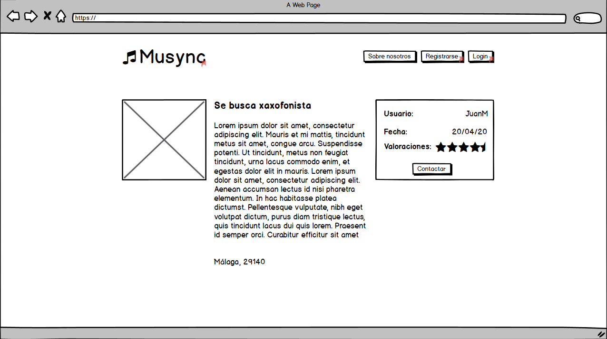
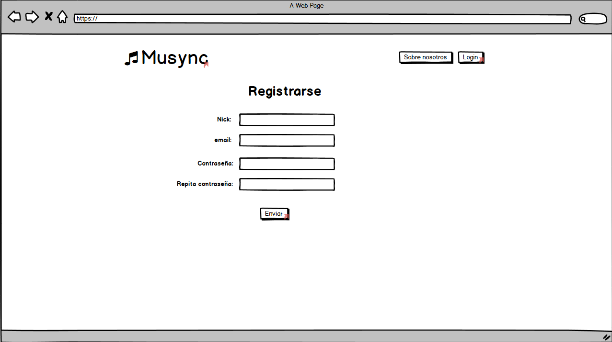
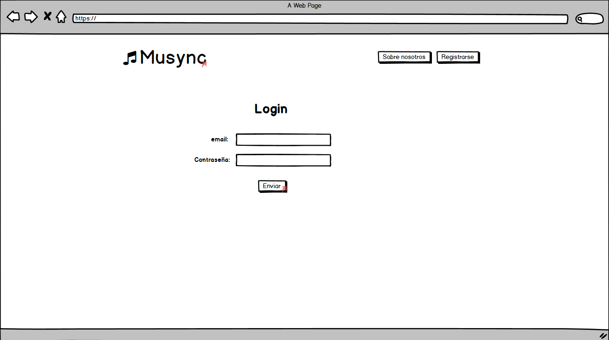
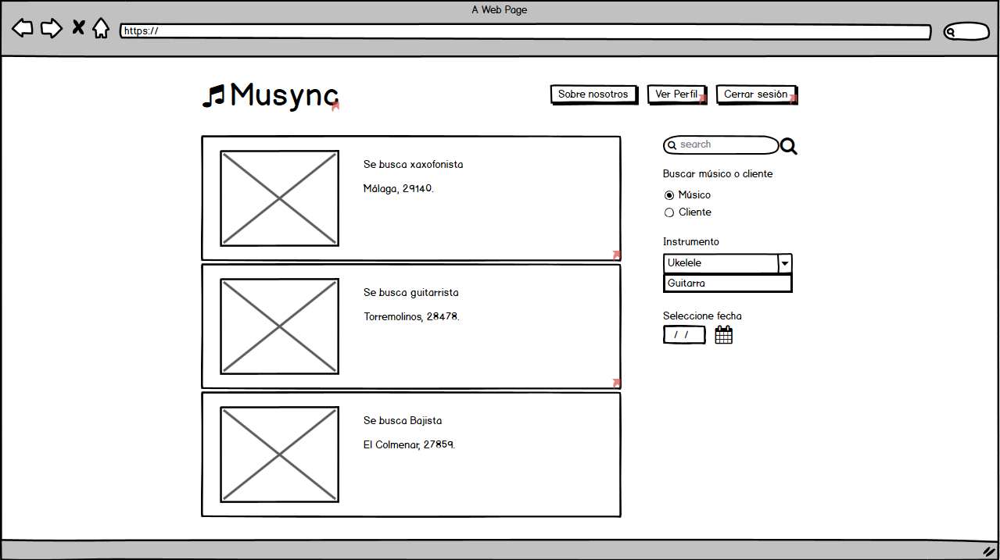

# Especificación de requisitos del proyecto Musync

Versión 1.0  
Generada por Grupo Musync  
Universidad de Málaga  
27/04/2020  

Índice
=================
* [Versiones](#versiones)
* 1 [Introducción](#1-introducción)
  * 1.1 [Objetivo del documento](#11-objetivo-del-documento)
  * 1.2 [Ámbito del proyecto](#12-ámbito-del-proyecto)
  * 1.3 [Definiciones, acrónimos y abreviaturas](#13-definiciones-acrónimos-y-abreviaturas)
  * 1.4 [Referencias](#14-referencias)
  * 1.5 [Resumen del documento](#15-resumen-del-documento)
* 2 [Vista general del producto](#2-vista-general-del-producto)
  * 2.1 [Perspectiva del producto](#21-perspectiva-del-producto)
  * 2.2 [Funciones del producto](#22-funciones-del-producto)
  * 2.3 [Restricciones del producto](#23-restricciones-del-producto)
  * 2.4 [Perfiles de usuario](#24-perfiles-de-usuario)
  * 2.5 [Suposiciones y dependencias](#25-suposiciones-y-dependencias)
* 3 [Interfaces externas](#3-interfaces-externas)
    * 3.1 [Interfaces con el Usuario](#31-interfaces-con-el-usuario)
    * 3.2 [Interfaces con el Hardware](#32-interfaces-con-el-hardware)
    * 3.3 [Interfaces con el Software](#33-interfaces-con-el-software)
* 4 [Requisitos](#4-requisitos)
  * 4.1 [Precedencia y prioridad](#41-precedencia-y-prioridad) 
  * 4.2 [Funcionales](#42-funcionales)
  * 4.3 [Calidad de Servicio](#43-calidad-de-servicio)
    * 4.3.1 [Rendimiento](#431-rendimiento)
    * 4.3.2 [Seguridad](#432-seguridad)
    * 4.3.3 [Fiabilidad](#433-fiabilidad)
  * 4.4 [Normativas aplicables](#44-normativas-aplicables)
  * 4.5 [Diseño e implementación](#45-diseño-e-implementación)
    * 4.5.1 [Instalación](#451-instalación)
    * 4.5.2 [Mantenimiento](#452-mantenimiento)
    * 4.5.3 [Coste](#453-coste)
    * 4.5.4 [Fecha de Entrega](#454-fecha-de-entrega)
* 5 [Verificación](#5-verificación)
* 6 [Apendices](#6-apendices) 
  
## Versiones
| Name                  | Date       | Reason For Changes                                           | Version |
| --------------------- | ---------- | ------------------------------------------------------------ | ------- |
| Omar Serrano Doukkali | 04/05/2020 | Creación del documento de grupo                              | 0.8     |
| Omar Serrano Doukkali | 07/05/2020 | Descripción de la mayoría de requisitos                      | 0.8.5   |
| Omar Serrano Doukkali | 08/05/2020 | Terminados los requisitos por el momento y resueltos 2 de los 3 puntos del issue del profesor | 0.9     |
| Adrián Laguna Machuca | 30/05/2020 | Revisión para comprobar que los requisitos están acordes a la actualidad|  0.10  |

## 1. Introducción
### 1.1 Objetivo del documento
Este documento describirá los requisitos software para la aplicación *Musync*, una aplicación de intercambio de servicios musicales entre usuarios.

### 1.2 Ámbito del proyecto
*MuSync* es una aplicación web y móvil que comunica a músicos que quieren unirse a un grupo, integrar a un tercero en su banda o suplir la baja ocasional de algún miembro. Este sistema funciona a través de anuncios de oferta y demanda que los propios usuarios publican en un tablón de anuncios común. Los músicos podrán suplir sus carencias sin tener que recorrer toda su zona colgando carteles. *MuSync* cuenta con la siguientes ventajas:  

* Se disminuye la aparición de desconocidos poco confiables gracias a un sistema de perfiles y valoración pública de los mismos.  
* Al ser una aplicación que puede descargarse cualquiera, los anuncios tendrán una mayor visibilidad, evitando el problema de que la difusión se reduzca a simplemente conocidos.  
* Los usuarios podrán evitar dar sus datos personales a todo el mundo, reduciéndolo a solamente los demás músicos con los que acuerden citas.

### 1.3 Definiciones, acrónimos y abreviaturas

- SRS:  Software Requirement Specification, o ERS (Especificación de requisitos de Software)
- SO: sistema operativo.
- Google Chrome: navegador desarrollado por Google.
- Angular: es un framework para el desarrollo de aplicaciones web. Para más información, consulte el - [Apéndice A](#6-apendices).
- Ionic: es un framework para la personalización de la aplicación web. Para más información, consulte el [Apéndice B.](#6-apendices)
- Firebase: base de datos a utilizar en el proyecto. Para más información, consulte el [Apéndice C.](#6-apendices)
- MITM: Man in the Middle, es un tipo de ataque cibernético en el que el atacante espía las conversaciones entre varias entidades a modo de interceptar sus comunicaciones.
- Hash: cadena de caracteres resultante de codificar una cadena con un algoritmo de cifrado tipo hash o de un sentido. Solo puede cifrar una contraseña, pero no descifrarla. Útil para almacenar datos sensibles que solo necesitan confirmación.
- Músico: usuario que utiliza la aplicación de forma normal. Es decir, el usuario que simplemente ve y publica anuncios, interactúa con ellos y con el resto de músicos.  
- Administrador: usuario que, como su nombre indica, administra la aplicación. Controla permisos sobre los usuarios, elimina anuncios indebidos y es informado sobre comportamientos indeseados sobre otros usuarios. 
- Banear: restringir el acceso a la aplicación.
- Reportar: informar sobre una infracción para que un administrador lo compruebe y tome medidas.
- Cuenta: conjunto de datos que un usuario utiliza para identificarse en el sistema, logearse y sobre los que se puede manipular permisos y datos necesarios. Son los datos vistos de cara al usuario dueño de ellos.  
- Perfil: vista de los datos de un usuario de cara a los usuarios que no son dueños de la cuenta correspondiente. 

### 1.4 Referencias
*Se añadirán los documentos referentes a casos de uso cuando se llegue a una correción*

### 1.5 Resumen del documento

************************************ *************************************************** *************** ************* ************************ **************************************************** ***** *************************************************** ******************************************************** ************

El documento a partir de este punto se dividirá en 5 apartados:

* **Vista general del producto**:

  Que describe los factores generales que afectan al producto que se genera y sus requisitos de usuario y negocio.

* **Requisitos:**
  Donde se especifican los requisitos del producto a nivel de sistema.

* **Interfaces:**
  

Donde se especifican las distintas vistas que interactúan con los usuarios o con el sistema.

* **Verificación:**
  Donde se establece una visión general de cómo se va a verificar la calificación de calidad del software.

* **Apéndices:**
  Donde se hablará un poco más sobre las tecnologías a utilizar dando enlaces a más información.

## 2. Vista general del producto
### 2.1 Perspectiva del producto
*Musync* es una nueva aplicación que únicamente requiere de un dispositivo con navegador web. Es un producto independiente que una vez lanzado pasará a la versión 1.0.

No es la invención de nada totalmente nuevo. Existe Wallapop, que utiliza el mismo sistema, pero con perspectiva de compraventa. Existen versiones aplicadas a páginas de citas. Existen incluso subversiones de la versión de compraventa (compraventa de coches, de casas, etc.). Esta aplicación es la forma sencilla de llevar esta estructura de aplicación a los músicos que siempre dependen de los únicos contactos que tienen.

Cuando salga la aplicación a la luz, tendrá diferentes competencias, hay varias aplicaciones parecidas en la actualidad, entre ellas:  

* **Bandmix**, la cual es una web para buscar miembros de grupos de música o bandas a las que unirse 

* **Bandfriend**, hablamos de una aplicación para *android* o IOS, la cual se enfoca en ponerse en contacto con otros músicos. 

* **Vampr**, aplicación de *android* e IOS. Eliges las preferencias de músicos que necesitas y te salen en el feed con la opción de hacer swipe a la derecha o a la izquierda depende de si tienes interés o no.

### 2.2 Funciones del producto

Las funciones de las que dispone la aplicación son la administración de usuarios, soporte para administradores y usabilidad para los músicos.     

* Administración de usuarios:  Los usuarios podrán registrarse, iniciar sesión, cerrar la sesión y editar su usuario. En la edición del usuario entran el nombre de usuario, la contraseña, la imagen de perfil, la descripción y los instrumentos que tocan. Además si no desean pertenecer mas a Musync, eliminar su usuario.    

*  Soporte para administradores: Los administradores pueden ver y banear usuarios, ya sea temporal o permanentemente, así como ver y eliminar publicaciones. Cuentan con un visor de reportes, que los músicos notifican, pero son los administradores los que toman las medidas.     

* Músicos: Los músicos pueden listar y crear anuncios, además de editar y eliminar sus propios anuncios en el sistema, responder a aquellos en los que estén interesados y notificar a los administradores de infracciones de usuarios o publicaciones. Los usuarios cuentan con un sistema de calificación entre ellos en el que se evalúan mediante la relección que mantienen.

Para más detalles, puede consultar la [referencia 1](#14-referencias).

### 2.3 Restricciones del producto
- La aplicación deberá estar implementada en *Angular* e *Ionic*, además de usar *Firebase* para la gestión con la base de datos.

- La conexión a Internet también es una restricción para la aplicación dado que la aplicación obtiene datos de la base de datos a través de Internet. Es crucial que exista una conexión a Internet para que la aplicación funcione.

- La velocidad de la aplicación estará limitada por la capacidad y/o velocidad de conexión con la base de datos.

- Un usuario deberá afirmar que tiene al menos 16 años. Se le preguntará al crear una cuenta.

- Esta aplicación deberá atenerse a toda ley, como la LOPD. Ningún usuario podrá acceder a los datos de otro si éste último no los hace públicos o no concede permiso.

### 2.4 Perfiles de usuario
* Usuario no registrado.
  * Ver anuncio.
  * Buscar anuncio.
  * Registrarse.
* Usuario registrado
  * Músico
    * Login.
    * Ver anuncio.
    * Buscar anuncio.
    * Editar perfil propio.
    * Reportar anuncio.
    * Reportar usuario.
    * Borrar cuenta propia.
    * Añadir anuncio.
    * Borrar anuncio propio.
    * Responder anuncio ajeno.
    * Responder mensajes.
    * Asignar a otro músico a un anuncio propio.
  * Administrador
    * Login.
    * Ver anuncio.
    * Buscar anuncio.
    * Banear temporal o permanentemente cuenta ajena.
    * Borrar anuncio ajeno.
    * Acceder a reportes.

### 2.5 Suposiciones y dependencias

Se usarán los siguientes programas:

* Ionic versión 5.4.16
* Angular versión 9.1.3
* Firebase
* Visual Studio Code 1.44.2
* Github Desktop APP 2.4.1

## 3 Interfaces externas
### 3.1 Interfaces con el usuario 

Lo primero que aparezca en cuanto el usuario entre a la aplicación es una vista con algunos anuncios, el buscador, el logo de la aplicación y los botones para registrarse o hacer un login.

Al pinchar en un anuncio, éste se abrirá y se mostrará la información relevante sobre el anuncio. En caso de ser uno propio se podrá editar o borrar; o en caso de ser administrador se podrá borrar.

Al pinchar en *Registrarse*, deberá aparecer un formulario con los datos relevantes para la aplicación, que deberán ser rellenos de forma correcta. Al aceptar los datos, se mandará a la página de *login*.

En la página de *login* se pedirá su nombre de usuario o email y su contraseña. Al poner lo datos correctos se redireccionará a la vista principal.

En ella ya no aparecen los botones de registrarse o login, sino uno para ver su perfil. Al pinchar en él se permite editarlo en su botón específico o borrarlo.

### 3.2 Interfaces con el Hardware
Como el sistema no está diseñado para un hardware específico, no necesita ninguna interfaz directa con el hardware. Todo será gestionado por el SO y por Angular.

### 3.3 Interfaces con el Software
Toda las conexiones entre el hardware las realizará *Angular*, que es el framework principal en la que está implementada el proyecto. Éste utiliza http y https como sus protocolos de comunicaciones y su interfaz esta basada en html y css usando además javascript. Además tiene de serie la integración con la base de datos Firebase, e Ionic funciona como una herramienta integrada en Angular para facilitar la customización de la aplicación.

Para ver una lista de navegadores compatibles con Ionic pinche [aquí](https://ionicframework.com/docs/reference/browser-support).

## 4. Requisitos
### 4.1 Precedencia y prioridad
| Id    | Nombre                  | Descripción                                                  | Prioridad   | Precedencia        | Tipo         |
| ----- | ----------------------- | ------------------------------------------------------------ | ----------- | ------------------ | ------------ |
| RF1   | Crear anuncio           | Un músico podrá crear un anuncio.                             | Fundamental | RF8                | Funcional    |
| RF2   | Buscar anuncio          | Un usuario podrá buscar anuncios por categorías y métodos de filtrado. | Fundamental | Ninguna            | Funcional    |
| RF3   | Ver anuncio             | Un usuario podrá ver anuncios.                               | Fundamental | Ninguna/RF2        | Funcional    |
| RF4   | Editar anuncio          | Un músico podrá editar su anuncio.                            | Fundamental | RF3 y RF8          | Funcional    |
| RF5   | Eliminar anuncio        | Un músico podrá eliminar su anuncio o un administrador podrá eliminar cualquiera.     | Fundamental | RF3 y RF8          | Funcional  |
| RF6   | Reportar anuncio        | Un usuario podrá reportar un anuncio.                         | Deseable    | RF3 y RF8          | Funcional    |
| RF7   | Registrarse             | Un usuario podrá registrarse.                                | Fundamental | Ninguna            | Funcional    |
| RF8   | Login                   | Un músico o administrador podrán identificarse en el sistema. | Fundamental | RF7                | Funcional    |
| RF9   | Cerrar sesión           | Un músico o administrador podrán cerrar su sesión.            | Fundamental | RF8                | Funcional    |
| RF10  | Ver perfil propio       | Un músico podrá ver su propio perfil.                         | Fundamental | RF8                | Funcional    |
| RF11  | Editar perfil           | Un músico podrá editar su propio perfil.                      | Deseable    | RF10               | Funcional    |
| RF12  | Asignar a anuncio       | Un músico podrá asignar a otro a su anuncio.                 | Deseable    | RF1 y RF3          | Funcional    |
| RF13  | Valorar músico          | Un músico podrá valorar a otro.                               | Deseable    | RF8                | Funcional    |
| RF14  | Reportar músico         | Un músico podrá reportar a otro músico.                       | Opcional    | RF8 y RF16         | Funcional    |
| RF15  | Sistema de mensajería   | Un músico podrá contactar con otro sobre anuncios.            | Opcional    | RF3 y RF8          | Funcional    |
| RF16  | Ver perfil músico       | Un usuario podrá ver el perfil de un músico.                  | Fundamental | RF3/RF18           | Funcional    |
| RF17  | Eliminar cuenta         | Un músico podrá eliminar su cuenta.                           | Fundamental | RF8 y RF10         | Funcional    |
| RF18  | Buscar músico           | Un administrador podrá buscar músico.                         | Deseable    | RF8                | Funcional    |
| RF19  | Ver anuncios reportados | Un administrador podrá ver los anuncios reportados por los usuarios. | Deseable    | RF8 y RF6          | Funcional    |
| RF20  | Ver músicos reportados  | Un administrador podrá ver los músicos que han sido reportados por los usuarios. | Deseable    | RF8 y RF14         | Funcional    |
| RF21  | Banear músico           | Un administrador podrá banear un músico temporal o permanentemente. | Deseable    | RF8 y RF18/RF16    | Funcional    |
| RNFS1 | Cifrado contraseñas     | Las contraseñas deberán almacenarse en su versión *hash*     | Fundamental | Ninguna            | No Funcional |
| RNFS2 | Cifrado comunicaciones  | Las comunicaciones deberán ser cifradas por https            | Fundamental | Ninguna            | No Funcional |
| RNFF1 | Control de usabilidad   | Se realizarán pruebas para medir la facilidad de usabilidad de la aplicación. | Deseable    | Ninguna            | No Funcional |
| RNFR1 | Alta respuesta          | El sistema deberá responder las peticiones del usuario en menos de 1 segundo. | Deseable    | Ninguna            | No Funcional |
| RNFI1 | Instalación sencilla    | La aplicación deberá poder usarse de forma efectiva en cualquier navegador Chrome con versión superior a la usada al empezar el proyecto. | Fundamental | Ninguna            | No Funcional |
| RNFI2 | Estándar de desarrollo  | El software deberá ser implementando pensando en su futuro mantenimiento de 5 años. Creando lo necesario para conseguirlo. | Fundamental | Ninguna            | No Funcional |
| RNFI4 | Coste estipulado        | El coste del producto no deberá exceder lo estipulado por el cliente. La cantidad de $X \ €$. | Fundamental | Ninguna            | No Funcional |
| RNFI5 | Entrega el 5/6/2020     | El proyecto deberá entregarse el 5/6/2020.                   | Fundamental | Las fundamentales. | No Funcional |

### 4.2 Funcionales

#### RF1 -  Crear anuncio

Un usuario podrá crear un anuncio con los siguientes datos:

* Título del anuncio
* Código postal
* Descripción del anuncio
* Instrumentos
* Fecha

##### Dependencias 

Login(RF8)

##### Prioridad 

Fundamental

##### Justificación

Crear anuncios es una función fundamental para un usuario que interaccione con la aplicación, pues los anuncios es el elemento fundamental de ésta.

#### RF2 - Buscar anuncio

Un usuario podrá buscar anuncios por distintos métodos de filtrado.

Los métodos de filtrado son:

* Zona
* Instrumento
* Fecha

##### Dependencias 

Ninguna

##### Prioridad 

Fundamental  

##### Justificación

El elemento principal de la aplicación son los anuncios. El método de búsqueda es uno de los fundamentales en este proyecto.

#### RF3 - Ver anuncio

Un usuario podrá ver detalles de anuncios como:

* Título del anuncio
* Fecha del anuncio
* Descripción del anuncio
* Datos del usuario anunciante
* Zona donde ocurre el anuncio

##### Dependencias 

Ninguna/Buscar anuncio(RF2)

##### Prioridad 

Fundamental

##### Justificación

El elemento principal de la aplicación son los anuncios. El método de ver anuncios es uno de los fundamentales en este proyecto.

#### RF4 -  Editar anuncio

Un usuario podrá editar los siguientes datos de un anuncio propio:

* Título del anuncio
* Código postal
* Descripción del anuncio
* Instrumentos
* Fecha

##### Dependencias 

Ver anuncio(RF3) y Login(RF8)

##### Prioridad 

Fundamental

##### Justificación

Editar anuncios es una función fundamental para un usuario que interaccione con la aplicación, pues los anuncios es el elemento fundamental de ésta y en caso de error por parte del usuario deberá poder cambiar los anuncios sin tener que obligarle a eliminarlo y crear uno nuevo.

#### RF5 -   Eliminar anuncio

Un músico podrá eliminar su anuncio o un administrador podrá eliminar cualquiera.

##### Dependencias 

Ver anuncio(RF3) y Login(RF8)

##### Prioridad 

Fundamental

##### Justificación

Eliminar un anuncio, bien porque ya se haya llegado a un acuerdo entre usuarios o porque ya no lo necesite es una función fundamental en una aplicación como esta.

#### RF6 - Reportar anuncio

Un usuario podrá reportar anuncios que crea que infringen las normas de la aplicación. En tal caso el anuncio se enviará a un administrador para su verificación.

##### Dependencias 

Ver anuncio(RF3) y Login(RF8)

##### Prioridad 

Deseable

##### Justificación

Es posible que algunos usuarios hagan un uso indebido de la aplicación, algo que en aplicaciones en crecimiento es un problema, ya que los administradores no pueden comprobar que todos los anuncios siguen las normas. Por ello brindar a los usuarios un botón para que avisen a un administrador parece una funcionalidad deseable para la aplicación.

#### RF7 - Registrarse  

Un usuario podrá registrarse en la aplicación para hacer uso de funcionalidades extendidas propias de un usuario registrado.

Los datos a proporcionar son:

* Email
* Nick
* Contraseña
* Confirmación contraseña
* Nombre
* Apellidos
* Código postal

##### Dependencias 

Ninguna

##### Prioridad 

Fundamental  

##### Justificación

Un usuario tiene que registrarse para poder tener sus datos y ofrecerle un servicio personalizado.

#### RF8 -  Login  

Un usuario podrá identificarse en el sistema.

Los datos a proporcionar son:

* Email
* contraseña

##### Dependencias 

Registrarse (RF7)

##### Prioridad 

Fundamental  

##### Justificación

Una vez que tenga una cuenta, deberá poder identificarse en el sistema.

#### RF9 - Cerrar sesión

Un usuario podrá cerrar su sesión mediante un botón en la esquina superior derecha.

##### Dependencias 

Login(RF8)

##### Prioridad 

Deseable.

##### Justificación

Un usuario debería poder cerrar su sesión, por temas de seguridad.

 

#### RF10 - Ver perfil propio

Un usuario podrá ver su propio perfil.

##### Dependencias 

Login(RF8)

##### Prioridad 

 Deseable.

##### Justificación

Un usuario debería poder ver su perfil, para así ver sus datos en todo momento.

#### RF11 - Editar perfil  

Un usuario podrá editar su propio perfil.

Los datos a editar son:

* Nombre
* Apellidos
* Código postal
* Nick
* Imagen de perfil
* Instrumentos
* Contraseña

##### Dependencias 

Ver perfil propio(RF10)

##### Prioridad 

Deseable

##### Justificación

Editar el perfil personal es una función deseable en nuestra aplicación, que se implementará cuando todas las fundamentales estén operativas.

#### RF12 - Asignar a anuncio  

Un músico podrá asignar otro músico a un anuncio para que el anuncio tenga una resolución. Luego el anuncio pasará al estado "cogido".

Al clickar en el botón "asignar usuario" se abrirá un formulario donde se escribirá el usuario con el que se ha llegado a un acuerdo.

##### Dependencias 

Ver anuncio(RF3) y Crear anuncio(RF1) 

##### Prioridad 

Deseable

##### Justificación

Tener la posibilidad de decirle al sistema que tu anuncio ya está cogido es una funcionalidad deseable en nuestra aplicación. Eso impide que los usuarios intenten contactar con el músico que ya ha llegado a un acuerdo con otro.

#### RF13 - Valorar músico

Una vez que un músico ha aceptado a otro en un anuncio, éste último podrá valorar al músico cuando acabe la fecha del anuncio. Entrando en el anuncio tendrá un botón para valorar al músico, en una escala de 0 a 5.

##### Dependencias 

Asignar a anuncio(RF12)

##### Prioridad 

Deseable

##### Justificación

Es interesante que los músicos que usen el sistema de forma adecuada puedan valorarse entre sí, ya que con el tiempo habrá músicos con buenas valoraciones y otros podrán guiarse por ellas para interactuar entre sí. Entonces, uno con malas valoraciones tendrá menos éxito que uno con buenas.

#### RF14 - Reportar músico 

Un músico podrá reportar a otro desde la vista del perfil de otro músico. Al hacerlo aparecerá un formulario donde el músico que reporta podrá escribir una razón para que la vea el administrador.

##### Dependencias 

Login(RF8) y Ver perfil músico(RF16)

##### Prioridad 

Opcional

##### Justificación

En caso de que un músico incumpla las normas de la aplicación, o su comportamiento hacia otros no sea el correcto, parece lógico que los músicos afectados puedan reportarlo, para que así un administrador pueda ver el caso y tomar medidas al respecto.

#### RF15  - Sistema de mensajería

Los músicos podrán mandar mensajes entre sí para así cerrar sus tratos de una manera eficiente y comunicarse. Se mostrará en el perfil de usuario ajeno.

Cada músico tendrá una vista de mensajería con una vista global con todos sus mensajes.

##### Dependencias 

Ver anuncio(RF3) y Login(RF8)

##### Prioridad 

Opcional

##### Justificación

Implementar un sistema de mensajería eficiente sería un añadido muy importante para la aplicación, ya que facilitaría a los usuarios cerrar tratos y haría la aplicación mucho más dinámica y llamativa.

#### RF16 - Ver perfil músico

Un usuario podrá pinchar en el perfil de un músico para ver detalles de éste. Este botón aparecerá cuando un usuario pincha en un anuncio, solo pudiendo ver perfiles de músicos que hayan subido uno.

##### Dependencias 

Ver anuncio(RF3)/Bucar músico(RF17)

##### Prioridad 

Fundamental

##### Justificación

Al ser los anuncios la pieza clave de la aplicación, se debe permitir a los usuarios interactuar y ver los perfiles ajenos de los usuarios que suben anuncios.

#### RF17 - Eliminar cuenta 

Un músico puede eliminar su cuenta de la aplicación. El botón aparecerá en la vista de su perfil.

##### Dependencias 

Login (RF8) y Ver perfil propio(RF10)

##### Prioridad 

Fundamental

##### Justificación

Un usuario registrado debe poder eliminar su cuenta y sus datos de cualquier lugar en los que éstos se alojen. Es un requisito fundamental para cumplir la LOPD.

#### RF18 - Buscar músico 

El administrador tendrá una vista para realizar una búsqueda de usuarios. Esta vista será accesible desde un botón con el mismo nombre que el requisito en la barra superior.

##### Dependencias 

Login(RF8)

##### Prioridad 

Deseable

##### Justificación

A un administrador le viene bien poder acceder un perfil concreto de manera rápida. Así como a veces deberá comprobar si dicho perfil existe y/o si está en activo.

#### RF19 - Ver anuncios reportados 

El administrador tendrá un botón que le llevará a una vista que mostrará todos los anuncios que han sido reportados por los usuarios además del motivo del reporte.

##### Dependencias 

Login(RF8) y Reportar anuncio(RF6)

##### Prioridad 

Deseable

##### Justificación

Cuando se da la opción a los usuarios de reportar anuncios que consideren inadecuados, después se ha de brindar al administrador alguna clase de vista sobre esos anuncios. En aplicaciones de gran tamaño no es viable para un administrador tener que adivinar los anuncios reportados, sino tener una vista sobre éstos.

#### RF20 - Ver músicos reportados

El administrador tendrá un botón que le llevará a una vista que mostrará todos los músicos que han sido reportados por los usuarios además del motivo del reporte.

##### Dependencias 

Login(RF8) y  Reportar músico(RF13)

##### Prioridad 

Deseable

##### Justificación

Es normal que en aplicaciones donde usuarios interactúan entre sí se forme alguna disputa, o haya usuarios que infringen las normas de uso de la aplicación. Cuando das la posibilidad a un músico para reportar a otro, el siguiente paso es darle al administrador una vista de todos los reportados.

#### RF21 - Banear músico

El administrador tendrá un botón para banear a un músico al acceder a su perfil, le hayan reportado o no. En caso de reporte, aparecerá una lista de usuarios que han reportado y el motivo.

##### Dependencias 

Login(RF8) y Ver músicos reportados (RF17)/Ver perfil músico(RF15)

##### Prioridad 

Deseable

##### Justificación

Es importante en una aplicación que un administrador tenga control sobre los usuarios. Algunos usuarios harán uso indebido de la aplicación, por lo que debe existir la opción de echarlos de la misma para no repercutir negativamente en los demás usuarios.

### 4.3 Calidad de Servicio
#### 4.3.1 Rendimiento

#### RNFR1 -  Alta respuesta

El sistema deberá responder las peticiones del usuario en menos de 1 segundo.

##### Dependencias 

Ninguna

##### Prioridad 

 Deseable

##### Justificación

Ningún usuario querría esperar demasiado a que su petición le llegue a su ordenador por culpa del servidor o la aplicación.

#### 4.3.2 Seguridad

#### RNFS1 - Cifrado contraseñas

Las contraseñas deberán almacenarse en su versión *hash*.

##### Dependencias 

Ninguna

##### Prioridad 

 Fundamental

##### Justificación

En caso de intrusión en el sistema, el atacante no podrá ver directamente las contraseñas de los usuarios, sino sus *hashes*.

#### RNFS1 -  Cifrado comunicaciones

Las comunicaciones deberán ser cifradas por protocolo cifrado y seguro https.

##### Dependencias 

Ninguna

##### Prioridad 

 Fundamental

##### Justificación

En caso de intrusión MITM, el atacante no deberá poder acceder directamente a la información en texto plano.

#### 4.3.3 Fiabilidad

#### RNFF1 -  Control de usabilidad

Se realizarán pruebas para medir la facilidad de usabilidad de la aplicación, tanto web como móvil. Para ello proporcionaremos la aplicación a usuarios sin experiencia y les daremos unas instrucciones para que prueben cada una de las funcionalidades de la aplicación, para así medir el número de errores que cometan. Al finalizar les pasaremos un cuestionario para recibir feedback.

El cuestionario consistirá en una pregunta sobre cómo de usable les ha parecido y una nota del 0 al 5. El test concluirá si la media de esa nota es superior a 4.

##### Dependencias 

Ninguna

##### Prioridad 

Deseable

##### Justificación

En aplicaciones móviles y web es importante que los usuarios puedan acceder y usar todas las funcionalidades posibles de la aplicación con la mayor facilidad posible. Una aplicación fácil de usar es más llamativa.

### 4.4 Normativas aplicables
#### RNFN1 -  LOPD

Esta aplicación deberá atenerse a la LOPD.

##### Dependencias 

Ninguna

##### Prioridad 

Fundamental

##### Justificación

Con esto se consigue mantener la aplicación en el marco legal de este país.

### 4.5 Diseño e implementación

#### 4.5.1 Instalación
#### RNFI1 -  Instalación sencilla

La aplicación deberá poder usarse de forma efectiva en cualquier navegador Chrome con versión superior a la usada al empezar el proyecto(81.0.4044.129).

##### Dependencias 

Ninguna

##### Prioridad 

Fundamental

##### Justificación

La aplicación debe ser usable por el público.

#### 4.5.2 Mantenimiento
#### RNFM1 -  Estándar de desarrollo

El software deberá ser implementando pensando en su futuro mantenimiento de 5 años, creando lo necesario para conseguirlo.

Se usará el patrón de diseño MVC, siguiendo estándares de desarrollo y haciendo hincapié en comentar código para facilitar su futuro mantenimiento.

Además se usará Git para llevar un control de versiones eficaz en el proyecto y de trabajo individual, subiendo las tareas con su identificador de la tarea.

##### Dependencias 

Ninguna

##### Prioridad 

Fundamental

##### Justificación

Con esto se pretende que se minimice el impacto de errores y tener un trabajo de equipo colaborativo.

#### RNFM2- Mantenimiento

La aplicación una vez esté lista estará mantenida y actualizada para el bueno uso de los usuarios, se hará balanceo de carga en caso de pico de usuarios, para que estos no sufran lentitud. El mantenimiento está estipulado para 5 años.

##### Dependencias 

Ninguna

##### Prioridad 

Fundamental

##### Justificación

Si la aplicación no tiene mantenimiento podría ir a la deriva en cualquier momento porque depende de muchos servicios externos.

#### 4.5.3 Coste
#### RNFI4 -  Coste estipulado

El coste del producto no deberá exceder lo estipulado por el cliente. La cantidad de $X \ €$.

##### Dependencias 

Ninguna

##### Prioridad 

Fundamental

##### Justificación

El precio estipulado.

#### 4.5.4 Fecha de entrega
#### RNFI5 -  Entrega el 5/6/2020

El proyecto deberá entregarse el 5/6/2020.

##### Dependencias 

Las fundamentales.

##### Prioridad 

Fundamental

##### Justificación

Es la fecha límite.

## 5. Verificación
En cada iteración habrá una fase de testing en la que se utilizará la aplicación y se comprobará que cada requisito funciona como es descrito en su correspondiente caso de uso (los cuales describen paso a paso las entradas y salidas esperadas). 

Además, se harán pruebas de rendimiento a fin de poder mejorar el sistema al máximo. Una de las pruebas será sobrecargar el sistema de peticiones y otra medir la velocidad de respuesta del servidor.

Para comprobar los requisitos referidos a “ser entendible”, haremos pruebas con usuarios externos, los cuales rellenarán cuestionarios que ofrecerán datos cuantificables (cuántos mensajes de error han entendido, cuántas de las funcionalidades ofrecidas…).

## 6. Apéndices
### Apéndice A: Sobre Angular

"**Angular** es un *framework opensource* desarrollado por [Google](https://angular.io/) para facilitar la creación y programación de aplicaciones web de una sola página, las webs SPA *(Single Page* *Application*)."

https://www.qualitydevs.com/2019/09/16/que-es-angular-y-para-que-sirve/

### Apéndice B: Sobre Ionic
"**Ionic** es una estructura tecnológica (Framework)  de código abierto que se utiliza en el desarrollo de aplicaciones móviles híbridas, es decir, se combinan el [HTML5](https://www.qualitydevs.com/2018/11/26/aplicaciones-moviles-multiplataforma/), CSS y JavaScript dando como resultado aplicaciones con una interfaz amigable e intuitiva para el usuario que luego se comercializan o descargan en plataformas como Android o IOs."

https://www.qualitydevs.com/2019/05/31/que-es-ionic-desarrollador-web/

### Apéndice C: Sobre Firebase

Es una herramienta de Google creada para facilitar la creación de aplicaciones Android, IOS o web. Permite hosting, base de datos, autenticación enviar notificaciones a varias plataformas, laboratorio de prueba, etc.

https://rockcontent.com/es/blog/que-es-firebase/
